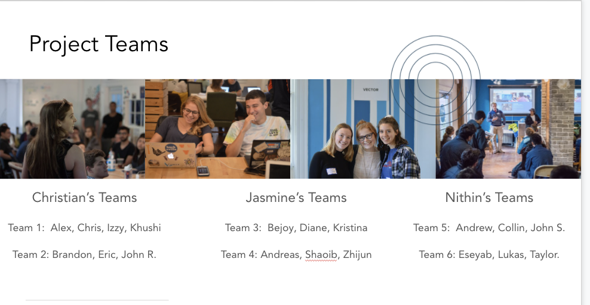
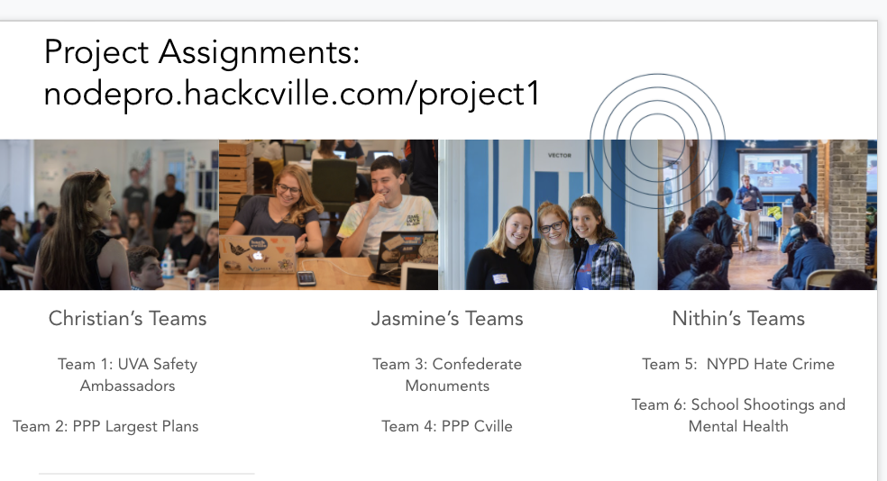

#  Lab 2 - Project Based Lab

For lab, this week you all will be working with your project teams to complete the project. During lab, it is up to you how you want to manage your time. I recommend meeting with your group once or twice before lab so you can start working on the project and use lab to ask for help. 

